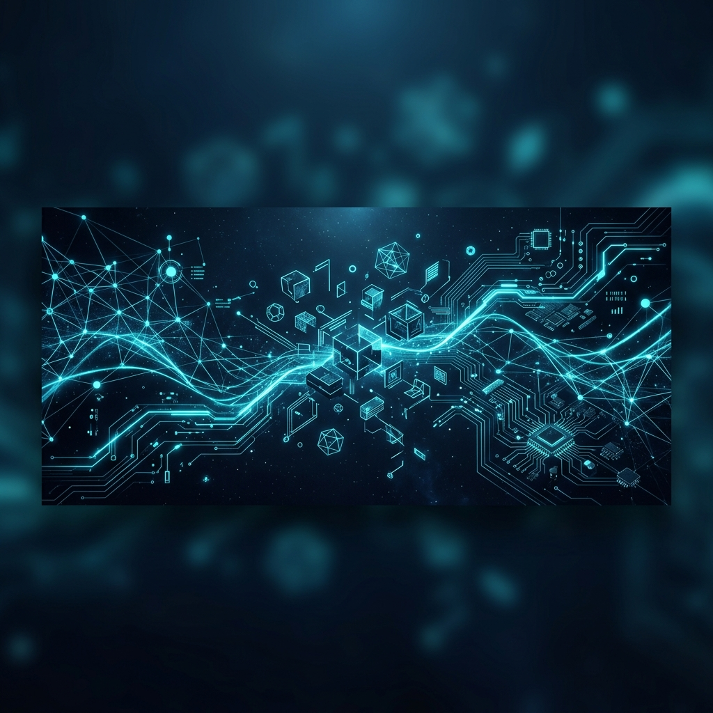

# 🌌 Antigravity Hub | Autonomous IA 2026

  

  
  
  

### 🏛️ Governança e Arquitetura
Nossa infraestrutura é organizada em **Camadas Estritas** para máxima escalabilidade:

*   **[CORE]** Infraestrutura, Hubs e Configurações de Sistemas.
*   **[N8N]** Workflows, Agentes de Automação e Orquestração.
*   **[APP]** Soluções Web, Sistemas Preditivos e Plataformas de Cliente.

### 📈 GitHub Stats

  
  

### 🛠️ Tech Stack & Ecosystem

  

---

  <b>🚀 Elevando a automação ao próximo nível com Antigravity.</b>

